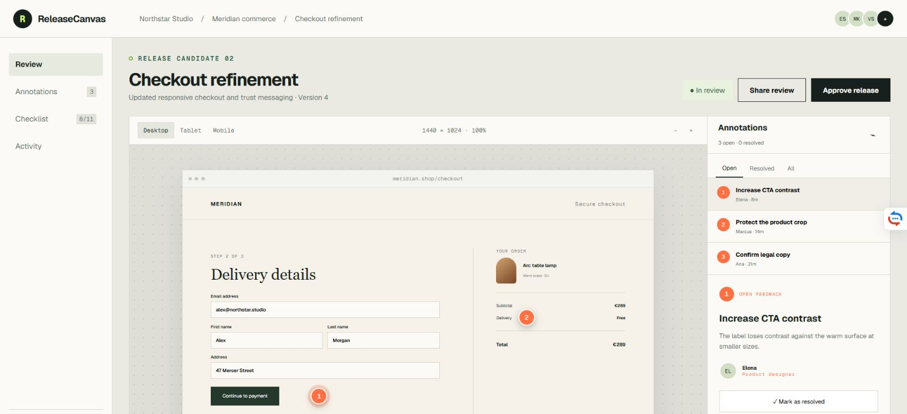
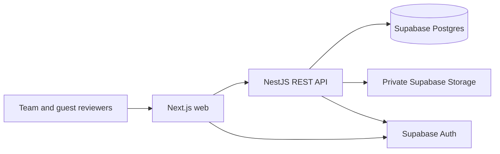
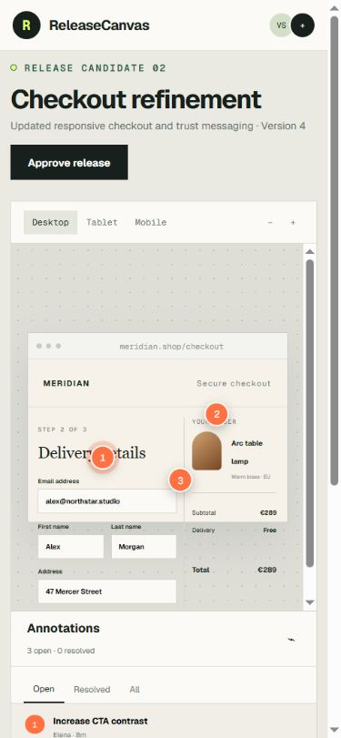

# ReleaseCanvas

ReleaseCanvas is a release-review workspace for agencies and product teams. Teams upload interface screenshots, pin precise feedback, resolve issues, and record an auditable approval decision before shipping.

**[Open the live product](https://release-canvas.vercel.app)** · **[Explore the recruiter demo](https://release-canvas.vercel.app/demo)** · **[API health](https://release-canvas-api-production.up.railway.app/v1/health)**

## Why this exists

Feedback scattered across chat, email, and meetings is difficult to reconcile. ReleaseCanvas puts the artifact, discussion, checklist, and final decision in one accessible workflow.

## Architecture

- `apps/web`: Next.js 16 product and recruiter demo
- `apps/api`: NestJS REST API with OpenAPI and health checks
- `packages/contracts`: shared Zod contracts and release state machine
- `supabase/migrations`: authoritative schema, RLS, and storage policies

Production runs on Vercel (web), Railway (Dockerized API), and Supabase (Postgres, Auth, private Storage, and the guest-review Edge Function).

## Local development

1. Copy `.env.example` to `.env` and add local Supabase values.
2. Run `pnpm install` and `pnpm dev`.
3. Open `http://localhost:3000`; API docs are at `http://localhost:4000/docs`.

The web app includes a populated recruiter demo. Production mutations require authenticated workspace membership.

## Security model

All tenant records carry `workspace_id`. The API validates JWT claims and membership, while Postgres RLS provides defense in depth. Files are private and accessed through short-lived signed URLs. Guest tokens are stored only as hashes.

## Production status

The landing page, recruiter demo, authenticated workspace, private upload flow, annotations, checklists, share links, and immutable guest decisions are deployed. CI validates linting, types, tests, builds, migrations, and database linting. Customer interviews and payment collection remain deliberately outside the technical MVP.

### Responsive review

## Tradeoffs

- Screenshot review first; video and PDF are deferred.
- REST and shared schemas keep the frontend/backend boundary explicit.
- SQL migrations are authoritative; Drizzle is a query layer only.
- Billing is deferred while usage limits remain part of the model.

## License

Copyright © 2026 Vladimir Scofari. Source-available for portfolio review; no license is granted for commercial redistribution.
